# XYCode Kerman —— 你好 Hi There 👋

业余编程爱好者，初中学生，半个OIer，正在备战CSP-J和GESP（bushi）和九年级中考。 / Amateur Programmer. A junior high school student and an OIer(maybe).

Preparing for CSP-J/GESP and **The Academic Test For The Junior High School Students in Grade Nine**(or *Senior High School Entrance Examination*).

(exclude Geography and Biology subject, they has benn finished in **ATJHSS in Grade Eight**).

主要工作语言为汉语，会一点点英语。 / Main working language is Chinese, and a little English.

自学法语中。 / Learning French.

最喜欢的三款游戏是《钢铁雄心4 (TNO)》、《戴森球计划》和《饿殍：明末千里行》。 / My favorite games are *HOI4(with TNO)*/*Dyson Sphere Program* and *The Hungry Lamp*.

## 爱好 / Hobbies

平时喜欢打游戏，倾向模拟类、剧情类游戏，P社战犯一枚。 / I like to play games in my spare time, leaning towards simulation and episodic games.

NeoVim、ArchLinux、LaTeX 用户。 / User of NeoVim, ArchLinux, LaTex and etc.

自由软件运动支持者、参与者。 / Free software movement supporter, participant.

马克思、列宁、毛泽东主义者。 / Marxist, Leninist, Maoist.

主张技术与政治无关。反对在技术社区（例如 Github）谈论政治问题。 / Assert that technology has nothing to do with politics. Oppose talking about politics in technical communities (e.g. Github).

## 开发计划 / Developing Plan

为了方便我规划各项目的开发时间，我制定了我的开发计划。 / To make it easier for me to plan the development time for each project, I created my development plan.

我的开发计划是一个类似于**栈**的结构，即先制定的计划先完成，后制定的计划后完成。一个项目的完成与否取决于该项目的大部分设计功能是否已经完成，项目完成后我任然将会保持对该项目的提交。 / My development plan is a structure similar to a **stack** in that the plans that are made first are completed first, and the plans that are made later are completed later. The completion of a project depends on the completion of most of the design features of the project, and I will still maintain submissions to the project after it is completed.

1. **YiriMiraiOneBot (Working)**
2. **CMAN (Working)**
3. AuthPI (Scheduled)
4. ItsWA (Scheduled)

> 注：CP Editor的项目名称默认为**unknown**（这说明我在刷题）。
>
> Note: The CP Editor's project name defaults to **unknown** (which means I'm learning OI).

## 学习 / Learning Path

